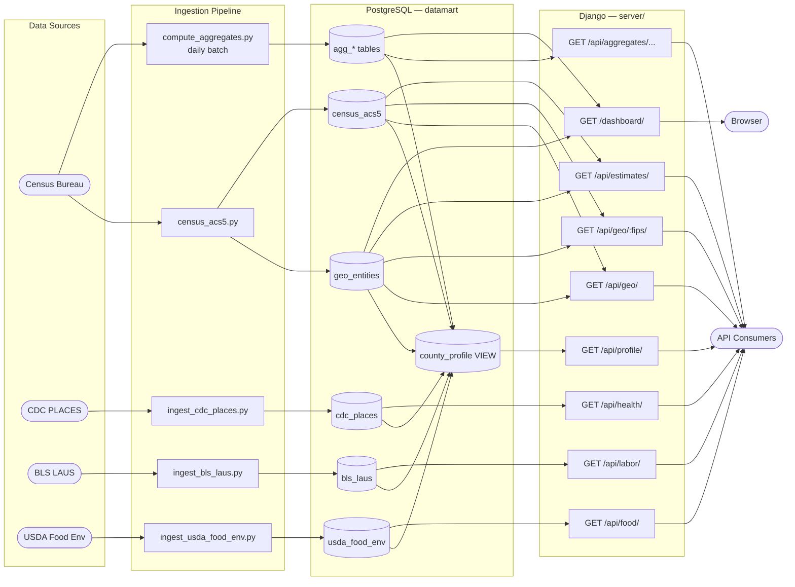

# Datamart — Design Document

## Overview

Datamart is a Data-as-a-Service platform that consolidates publicly available datasets into normalized, queryable PostgreSQL tables and exposes them through a REST API and an interactive web dashboard. The initial focus is U.S. Census Bureau data at state and county level, extended with county-level health, labor, and food environment data from CDC PLACES, BLS LAUS, and the USDA Food Environment Atlas.

The platform has two layers:

- **Public component** — a queryable API delivering normalized, entity-level data with filtering and pagination, plus a browser dashboard for exploratory analysis
- **Enterprise extension** (future) — private data integration allowing organizations to layer proprietary datasets on top of the public foundation

### Architecture



---

## Repository Layout

```
datamart/
├── config/
│   ├── .env                      # DB credentials and API keys (not committed)
│   └── .env.example
├── ingestion/
│   ├── census_acs5.py            # Census ACS5 fetch → normalize → load
│   ├── compute_aggregates.py     # Daily batch: recompute all agg_* tables
│   ├── ingest_cdc_places.py      # CDC PLACES health outcomes (Socrata API)
│   ├── ingest_bls_laus.py        # BLS Local Area Unemployment Statistics
│   └── ingest_usda_food_env.py   # USDA Food Environment Atlas (Excel file)
├── schema/
│   └── census.sql                # DDL for geo_entities and census_acs5 tables
├── migrations/
│   ├── 000_schema_version.sql
│   ├── 001_initial_schema.sql
│   ├── 002_aggregate_tables.sql
│   ├── 003_cdc_places.sql
│   ├── 004_bls_laus.sql
│   ├── 005_usda_food_env.sql
│   ├── 006_county_profile_view.sql
│   └── migrate.sh
├── server/
│   ├── manage.py
│   ├── requirements.txt
│   ├── datamart_api/             # Django project settings, urls, wsgi
│   ├── census/                   # Django app: REST API (models, serializers, views, urls)
│   └── dashboard/                # Django app: web dashboard
│       └── templates/dashboard/index.html
├── tests/
│   ├── test_ingestion.py         # Unit tests for Census ingestion helpers
│   ├── test_api.py               # Django integration tests for all API endpoints + dashboard
│   ├── test_aggregates.py        # Unit tests for compute_aggregates SQL builders
│   └── test_external_ingestion.py # Unit tests for CDC, BLS, USDA ingestion scripts
├── conftest.py                   # pytest path setup
└── pytest.ini
```

---

## Data Model

Core tables live in [`schema/census.sql`](schema/census.sql). Aggregate tables are created by [`migrations/002_aggregate_tables.sql`](migrations/002_aggregate_tables.sql). External-source tables are in migrations 003–005; the cross-source view is in 006.

### `geo_entities`

A reference table for every geographic unit the platform knows about. Currently populated with U.S. states and counties.

| Column      | Type          | Notes                                     |
|-------------|---------------|-------------------------------------------|
| `fips`      | VARCHAR(5) PK | 2 chars for states, 5 chars for counties  |
| `geo_type`  | VARCHAR(10)   | `'state'` or `'county'`                   |
| `name`      | VARCHAR(200)  | Human-readable name from Census API       |
| `state_fips`| CHAR(2)       | Parent state; same as `fips` for states   |

### `census_acs5`

One row per geography × year. All percentage fields are pre-computed ratios (not raw counts).

| Column               | Type         | Source variables                        |
|----------------------|--------------|-----------------------------------------|
| `fips`               | VARCHAR(5) FK| Links to `geo_entities`                 |
| `year`               | SMALLINT     | ACS5 vintage year                       |
| `population`         | INTEGER      | B01003_001E                             |
| `median_income`      | INTEGER      | B19013_001E                             |
| `pct_bachelors`      | NUMERIC(5,2) | B15003_022E / B15003_001E × 100         |
| `median_home_value`  | INTEGER      | B25077_001E                             |
| `pct_owner_occupied` | NUMERIC(5,2) | B25003_002E / B25003_001E × 100         |
| `pct_poverty`        | NUMERIC(5,2) | B17001_002E / B17001_001E × 100         |
| `unemployment_rate`  | NUMERIC(5,2) | B23025_005E / B23025_002E × 100         |
| `fetched_at`         | TIMESTAMPTZ  | Set to `NOW()` on insert/update         |

**Current data volume:** 3,283 geographies (52 state-equivalents + 3,231 counties), 5 vintages (2018–2022), ~16,400 estimate rows.

### Aggregate Tables

Pre-computed and fully rewritten on each daily batch run. All four tables have a `computed_at TIMESTAMPTZ` column.

#### `agg_national_summary`

Population-weighted national averages per year, derived from state-level data. Unique on `year`.

#### `agg_state_summary`

Population-weighted county rollups per state per year. Unique on `(state_fips, year)`.

Both tables share the same avg columns: `avg_median_income`, `avg_pct_bachelors`, `avg_median_home_value`, `avg_pct_owner_occupied`, `avg_pct_poverty`, `avg_unemployment_rate`.

#### `agg_rankings`

Rank and percentile for every geography × year × metric within its peer group (`geo_type`). Unique on `(fips, year, metric)`.

| Column      | Type          | Notes                                 |
|-------------|---------------|---------------------------------------|
| `fips`      | VARCHAR(5)    |                                       |
| `state_fips`| CHAR(2)       | Denormalized for state-level filtering|
| `geo_type`  | VARCHAR(10)   | Peer group                            |
| `year`      | SMALLINT      |                                       |
| `metric`    | VARCHAR(30)   | e.g. `median_income`                  |
| `value`     | NUMERIC(12,2) |                                       |
| `rank`      | INTEGER       | 1 = lowest value in peer group        |
| `percentile`| NUMERIC(5,2)  | 0–100                                 |
| `peer_count`| INTEGER       |                                       |

#### `agg_yoy`

Year-over-year absolute and percentage change per geography × metric. Unique on `(fips, year, metric)`.

| Column      | Type          | Notes                    |
|-------------|---------------|--------------------------|
| `year`      | SMALLINT      | The "current" year       |
| `value`     | NUMERIC(12,2) | Current year value       |
| `prev_value`| NUMERIC(12,2) | Prior year value         |
| `change_abs`| NUMERIC(12,2) | `value - prev_value`     |
| `change_pct`| NUMERIC(7,2)  | % change from prior year |

### External-Source Tables

#### `cdc_places`

County-level health outcome estimates from CDC PLACES (crude prevalence %). One row per county × year. Unique on `(fips, year)`.

| Column                 | Type         | CDC measure ID |
|------------------------|--------------|----------------|
| `pct_obesity`          | NUMERIC(5,1) | OBESITY        |
| `pct_diabetes`         | NUMERIC(5,1) | DIABETES       |
| `pct_smoking`          | NUMERIC(5,1) | CSMOKING       |
| `pct_hypertension`     | NUMERIC(5,1) | BPHIGH         |
| `pct_depression`       | NUMERIC(5,1) | DEPRESSION     |
| `pct_no_lpa`           | NUMERIC(5,1) | LPA (no leisure-time physical activity) |
| `pct_poor_mental_health` | NUMERIC(5,1) | MHLTH        |

Source: Socrata API at `https://data.cdc.gov/resource/swc5-untb.json`

#### `bls_laus`

Annual average unemployment and labor force estimates from BLS Local Area Unemployment Statistics. One row per county × year. Unique on `(fips, year)`.

| Column             | Type         | BLS series type |
|--------------------|--------------|-----------------|
| `labor_force`      | INTEGER      | 006             |
| `employed`         | INTEGER      | 005             |
| `unemployed`       | INTEGER      | 004             |
| `unemployment_rate`| NUMERIC(5,1) | 003             |

Series ID format: `LAUCN{5-digit-fips}0000000{3-digit-type}` (20 chars). Counties are fetched in batches of 50 series per request (BLS unregistered limit; 500 with a registered API key).

#### `usda_food_env`

County-level food environment metrics from the USDA Food Environment Atlas Excel file. One row per county × data vintage. Unique on `(fips, data_year)`.

| Column               | Type         | Atlas sheet   | Source column    |
|----------------------|--------------|---------------|------------------|
| `pct_low_food_access`| NUMERIC(5,1) | ACCESS        | PCT_LACCESS_POP15|
| `groceries_per_1000` | NUMERIC(6,2) | STORES        | GROCPTH16        |
| `fast_food_per_1000` | NUMERIC(6,2) | RESTAURANTS   | FSRPTH16         |
| `pct_snap`           | NUMERIC(5,1) | ASSISTANCE    | PCT_SNAP17       |
| `farmers_markets`    | INTEGER      | LOCAL         | FMRKT18          |

Download from USDA ERS (`https://www.ers.usda.gov/media/5569/food-environment-atlas-data-download.xlsx`). The workbook has a title row in row 1 and column headers in row 2; the script skips the title row automatically. Sentinel value `-9999` is treated as NULL. Run with `--file /path/to/atlas.xlsx` or `--download`.

### `county_profile` View

A cross-source read-only view joining all four data sources at county level. Each row is one county with the most recent available data from each source (via `LATERAL` subqueries ordered by year DESC). Exposed at `/api/profile/`.

---

## Ingestion Pipeline

### Census ACS5

Source: [ingestion/census_acs5.py](ingestion/census_acs5.py)

Fetches ACS5 data from `https://api.census.gov/data/{year}/acs/acs5`. Normalizes fields, handles sentinel values (`-666666666` → NULL), upserts into `geo_entities` and `census_acs5`. Single transaction per run.

### Aggregate Batch

Source: [ingestion/compute_aggregates.py](ingestion/compute_aggregates.py)

Truncates and fully recomputes all four `agg_*` tables in a single transaction. Population-weighted averages use `SUM(metric::numeric * population) / SUM(population) FILTER (WHERE metric IS NOT NULL)` to handle nulls without skewing denominators.

```bash
python ingestion/compute_aggregates.py
```

### CDC PLACES

Source: [ingestion/ingest_cdc_places.py](ingestion/ingest_cdc_places.py)

Fetches county-level health prevalence estimates from the CDC Socrata API (paginated, `$limit=50000` per page). Pivots raw measure rows into one row per county × year. Upserts into `cdc_places`.

```bash
python ingestion/ingest_cdc_places.py [--year 2022] [--app-token TOKEN]
```

### BLS LAUS

Source: [ingestion/ingest_bls_laus.py](ingestion/ingest_bls_laus.py)

Constructs BLS LAUS series IDs for all ~3,100 counties (4 series each: unemployment rate, unemployed, employed, labor force). Fetches in batches of 50 (or 500 with a registered API key) from the BLS Public Data API v2. Extracts annual average period (`M13`). Upserts into `bls_laus`.

```bash
python ingestion/ingest_bls_laus.py [--start 2018] [--end 2022] [--api-key KEY]
```

### USDA Food Environment Atlas

Source: [ingestion/ingest_usda_food_env.py](ingestion/ingest_usda_food_env.py)

Reads the USDA ERS Excel workbook (multiple sheets) using `openpyxl`. Merges columns from ACCESS, STORES, RESTAURANTS, ASSISTANCE, and LOCAL sheets by county FIPS. Upserts into `usda_food_env`.

```bash
python ingestion/ingest_usda_food_env.py --file /path/to/atlas.xlsx [--data-year 2018]
python ingestion/ingest_usda_food_env.py --download [--data-year 2018]
```

---

## API Layer

Source: [`server/census/`](server/census/)

Built with Django 6 and Django REST Framework. Models use `managed = False`. All list endpoints support `?page_size=N` (max 400) via `FlexiblePageNumberPagination` (default 50).

### Core endpoints

#### `GET /api/geo/`
Paginated list of geographic entities. Params: `geo_type` (`state`|`county`), `state_fips`.

#### `GET /api/geo/<fips>/`
Single geography with all ACS5 estimates embedded, ordered by year.

#### `GET /api/estimates/`
Flat, paginated estimates with geo metadata inlined. Params: `geo_type`, `state_fips`, `year`.

### Aggregate endpoints

#### `GET /api/aggregates/national/`
Params: `year`.

#### `GET /api/aggregates/state-summary/`
Params: `state_fips`, `year`.

#### `GET /api/aggregates/rankings/`
Params: `geo_type`, `state_fips`, `year`, `metric`.

#### `GET /api/aggregates/yoy/`
Params: `geo_type`, `state_fips`, `year`, `metric`. Returns `value`, `prev_value`, `change_abs`, `change_pct`.

### External-source endpoints

#### `GET /api/health/`
CDC PLACES health outcomes. Params: `fips`, `state_fips`, `year`.

#### `GET /api/labor/`
BLS LAUS annual unemployment. Params: `fips`, `state_fips`, `year`.

#### `GET /api/food/`
USDA Food Environment metrics. Params: `fips`, `state_fips`, `data_year`.

#### `GET /api/profile/`
Unified county profile joining all sources (most recent year per source). Params: `fips`, `state_fips`. Backed by the `county_profile` view.

### Validation

`geo_type`, `year`, and `metric` params are validated on all applicable endpoints; invalid values return HTTP 400 with a descriptive error body.

---

## Dashboard

Source: [`server/dashboard/`](server/dashboard/)

A browser-based dashboard served at `/dashboard/`. Built with Django templates, Bootstrap 5, and Chart.js.

All state-level aggregate data (Census, health, food) is embedded as JSON at render time. County-level data is fetched via AJAX when a state is selected. All results are cached client-side per state×year key so metric and chart switching after the first load is instant.

### Data embedded at render time

| Variable | Source |
|---|---|
| `national` | `agg_national_summary` — national Census averages per year |
| `stateSummary` | `agg_state_summary` — state-level Census rollups per year |
| `stateYoY` | `agg_yoy` (state rows only) — Census year-over-year changes |
| `stateHealth` | `cdc_places` GROUP BY LEFT(fips,2) — state avg of all 7 health metrics |
| `stateFood` | `usda_food_env` GROUP BY LEFT(fips,2) — state avg of all 5 food metrics; sentinel-filtered with `__gte=0` per column |

### All-states mode (no state selected)

| Chart | Type | Data source |
|---|---|---|
| National Trend | Line | `national` (embedded) — Census metrics only; hidden for health/food metrics |
| State Ranking | Horizontal bar | `stateSummary` (Census), `stateHealth`, or `stateFood` depending on active metric |
| YoY Movers | Horizontal bar (top 5 + bottom 5) | `stateYoY` (Census metrics only); shows "not available" note for health/food |

### County drill-down mode (state selected)

Seven panels are shown. County-level data is fetched in a single `Promise.all()`.

| Panel | Type | Data source | Cache key |
|---|---|---|---|
| National Trend | Line | Embedded (unchanged) | — |
| County Ranking | Horizontal bar | `/api/aggregates/rankings/` (Census) or `profileData` (health/food) | — |
| YoY Movers | Horizontal bar | `/api/aggregates/yoy/` (Census); note for health/food | — |
| Health Outcomes | Horizontal bar | `/api/health/?state_fips&year` | `healthCache[stateFips:year]` |
| Food Environment | Horizontal bar | `/api/food/?state_fips` | `foodCache[stateFips]` |
| Cross-source Scatter | Scatter | `/api/profile/?state_fips` | `profileCache[stateFips]` |
| County Data Table | Sortable table | `/api/profile/?state_fips` | `profileCache[stateFips]` (shared) |

Scatter and table share the same `profileData` fetch. Switching any sub-metric dropdown triggers `updateExternalOnly()`, which re-renders health, food, scatter, and table from cached data without re-fetching.

### Controls

- **Metric** dropdown — grouped optgroups covering all three sources: Census ACS5 (6 metrics), Health — CDC PLACES (7 metrics), Food — USDA Atlas (5 metrics). Drives the ranking chart and national trend.
- **Year** dropdown — vintage year (2018–2022); drives Census ranking/YoY and health endpoint calls.
- **Drill into State** dropdown — activates county mode; triggers a `Promise.all()` for all county data.
- **Health metric** dropdown (county mode) — which CDC PLACES measure to show in the health bar chart.
- **Food metric** dropdown (county mode) — which USDA metric to show in the food bar chart.
- **Scatter X / Y** dropdowns (county mode) — any metric from any source on each axis.

### Cross-source scatter

Plots each county in a selected state as a point with one metric on each axis. Defaults to Poverty Rate (X) vs Obesity % (Y). Any metric from any source can be chosen for either axis via the two selects in the card header. Negative and sentinel values are excluded (`x < 0 || y < 0`). County name appears in the tooltip.

### County data table

Sortable by any column. Shows 11 columns from all four sources per county: County Name, Population, Median Income, Poverty %, Bachelors %, Obesity %, Diabetes %, Depression %, Low Food Access %, SNAP %, Grocery Stores /1k. Column headers are color-coded by source (blue = Census, pink = Health, green = Food). Click a header to sort ascending; click again to sort descending.

---

## Testing

Source: [`tests/`](tests/)

Run with:
```bash
python -m pytest tests/ -v
```

**177 tests total.**

### test_ingestion.py — 36 unit tests

Pure Python, no database. Covers Census ACS5 ingestion helpers: `_int()`, `_pct()`, `normalize_state()`, `normalize_county()`, `_fetch()` (mocked HTTP), and `load()` (mocked psycopg2).

### test_api.py — 71 Django integration tests

Uses Django's `TestCase` with a real PostgreSQL test database. All `managed = False` tables are created via `connection.schema_editor()`. Four test classes:

- **`GeoAPITest`** — core endpoints, all filter params, 404, estimate ordering, validation
- **`AggregateAPITest`** — all four aggregate endpoints, filter params, validation
- **`DashboardTest`** — 200 response, embedded JSON, chart canvas IDs (including `healthChart`, `foodChart`), health/food metric label embedding, `externalSection` presence
- **`ExternalSourceAPITest`** — `/api/health/`, `/api/labor/`, `/api/food/`: all filter params and field presence
- **`CountyProfileAPITest`** — `/api/profile/`: filter by fips and state_fips, all source fields present, pagination

### test_aggregates.py — 30 unit tests

Pure Python. Covers `compute_aggregates.py` SQL builder functions: UNION ALL count, metric literals, window functions, transaction order.

### test_external_ingestion.py — 36 unit tests

Pure Python, no database or HTTP. Covers:

- **CDC PLACES** — `pivot()` (measure mapping, FIPS zero-padding, null handling), `fetch_places()` (single page, pagination trigger), `upsert()` (unknown FIPS skipped, commit called), `ingest()` (fetch+upsert integration)
- **BLS LAUS** — `build_series_id()` format, `parse_fips_from_series()` round-trip, `parse_bls_response()` (annual-only M13, data types), `upsert()` (execute count, commit)
- **USDA Food Env** — `_safe()` (type coercion, None/NA handling), `load_workbook_data()` (column mapping, FIPS padding, missing sheets, multi-sheet merge), `upsert()` (unknown FIPS skip, commit)

---

## Configuration

All secrets and connection details live in [`config/.env`](config/.env) (excluded from version control):

```
CENSUS_API_KEY=...
DB_HOST=localhost
DB_PORT=5432
DB_NAME=datamart
DB_USER=...
DB_PASSWORD=
DJANGO_SECRET_KEY=...      # required in production
DJANGO_DEBUG=true
DJANGO_ALLOWED_HOSTS=localhost,127.0.0.1
# Optional
CDC_APP_TOKEN=...          # Socrata app token (increases rate limits)
BLS_API_KEY=...            # BLS registered key (increases batch size 50 → 500)
```

---

## Schema

### Fresh install

Use `schema/schema.sql` to set up a brand-new database in one shot:

```bash
psql "$DB_URL" -f schema/schema.sql
```

This creates all tables and the `county_profile` view, and pre-populates `schema_migrations` so the migration runner knows they've been applied.

### Incremental migrations

For an existing database, `migrations/migrate.sh` applies only the pending numbered SQL files:

```
migrations/
  000_schema_version.sql       # bootstraps schema_migrations tracking table
  001_initial_schema.sql       # geo_entities + census_acs5
  002_aggregate_tables.sql     # agg_national_summary, agg_state_summary, agg_rankings, agg_yoy
  003_cdc_places.sql           # cdc_places table
  004_bls_laus.sql             # bls_laus table
  005_usda_food_env.sql        # usda_food_env table
  006_county_profile_view.sql  # county_profile cross-source view
  migrate.sh                   # runner: applies pending migrations in order
```

```bash
export $(grep -v '^#' config/.env | xargs)
./migrations/migrate.sh
```

### Adding a new migration

1. Add the DDL to `migrations/NNN_description.sql`, wrapped in `BEGIN; ... COMMIT;`, ending with an `INSERT INTO schema_migrations` statement
2. Apply the same change to `schema/schema.sql` so it stays current
3. Run `./migrations/migrate.sh` against the target database

---

## Roadmap

### Near-term
- **Range filters** on `/api/estimates/` — e.g., `pct_poverty__gte=20`, `median_income__lte=50000`
- **Additional Census variables** — health insurance (B27), commute time (B08), race/ethnicity (B02/B03)
- **Schedule ingestion** — GitHub Actions cron for daily `compute_aggregates.py`

### Platform
- **Token-based auth** — rate limiting and enterprise private views
- **BLS LAUS full load** — BLS free tier is capped at 500 API calls/day; register a free API key (`BLS_API_KEY` in `.env`) to load all ~3,200 counties in one run, or switch to the annual flat-file download (`laucnty{yy}.xlsx`)
- **World Bank / WHO** — country-level development indicators
