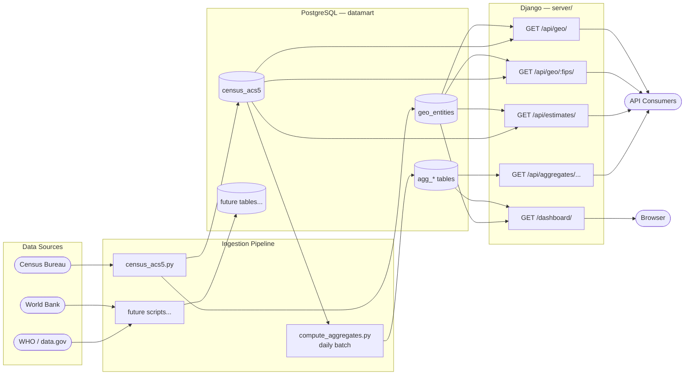
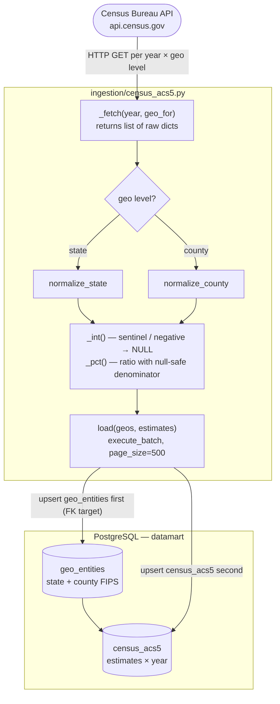

# Datamart — Design Document

## Overview

Datamart is a Data-as-a-Service platform that consolidates publicly available datasets into normalized, queryable PostgreSQL tables and exposes them through a REST API and an interactive web dashboard. The initial focus is U.S. Census Bureau data, with a roadmap to add World Bank, WHO, and other government sources.

The platform has two layers:

- **Public component** — a queryable API delivering normalized, entity-level data with filtering and pagination, plus a browser dashboard for exploratory analysis
- **Enterprise extension** (future) — private data integration allowing organizations to layer proprietary datasets on top of the public foundation

### Architecture



---

## Repository Layout

```
datamart/
├── config/
│   ├── .env                  # DB credentials and API keys (not committed)
│   └── .env.example
├── ingestion/
│   ├── census_acs5.py        # Census ACS5 fetch → normalize → load
│   └── compute_aggregates.py # Daily batch: recompute all agg_* tables
├── schema/
│   └── census.sql            # DDL for geo_entities and census_acs5 tables
├── migrations/
│   ├── 000_schema_version.sql
│   ├── 001_initial_schema.sql
│   ├── 002_aggregate_tables.sql
│   └── migrate.sh
├── server/
│   ├── manage.py
│   ├── requirements.txt
│   ├── datamart_api/         # Django project settings, urls, wsgi
│   ├── census/               # Django app: REST API (models, serializers, views, urls)
│   └── dashboard/            # Django app: web dashboard
│       └── templates/dashboard/index.html
├── tests/
│   ├── test_ingestion.py     # Unit tests for ingestion helpers
│   ├── test_api.py           # Django integration tests for all API endpoints + dashboard
│   └── test_aggregates.py    # Unit tests for compute_aggregates SQL builders
├── conftest.py               # pytest path setup
└── pytest.ini
```

---

## Data Model

Core tables live in [`schema/census.sql`](schema/census.sql). Aggregate tables are created by [`migrations/002_aggregate_tables.sql`](migrations/002_aggregate_tables.sql).

### `geo_entities`

A reference table for every geographic unit the platform knows about. Currently populated with U.S. states and counties.

| Column      | Type          | Notes                                     |
|-------------|---------------|-------------------------------------------|
| `fips`      | VARCHAR(5) PK | 2 chars for states, 5 chars for counties  |
| `geo_type`  | VARCHAR(10)   | `'state'` or `'county'`                   |
| `name`      | VARCHAR(200)  | Human-readable name from Census API       |
| `state_fips`| CHAR(2)       | Parent state; same as `fips` for states   |

### `census_acs5`

One row per geography × year. All percentage fields are pre-computed ratios (not raw counts).

| Column               | Type         | Source variables                        |
|----------------------|--------------|-----------------------------------------|
| `fips`               | VARCHAR(5) FK| Links to `geo_entities`                 |
| `year`               | SMALLINT     | ACS5 vintage year                       |
| `population`         | INTEGER      | B01003_001E                             |
| `median_income`      | INTEGER      | B19013_001E                             |
| `pct_bachelors`      | NUMERIC(5,2) | B15003_022E / B15003_001E × 100         |
| `median_home_value`  | INTEGER      | B25077_001E                             |
| `pct_owner_occupied` | NUMERIC(5,2) | B25003_002E / B25003_001E × 100         |
| `pct_poverty`        | NUMERIC(5,2) | B17001_002E / B17001_001E × 100         |
| `unemployment_rate`  | NUMERIC(5,2) | B23025_005E / B23025_002E × 100         |
| `fetched_at`         | TIMESTAMPTZ  | Set to `NOW()` on insert/update         |

The unique constraint on `(fips, year)` enables idempotent upserts.

**Current data volume:** 3,283 geographies (52 state-equivalents + 3,231 counties), 5 vintages (2018–2022), ~16,400 estimate rows.

### Aggregate Tables

Pre-computed and fully rewritten on each daily batch run. All four tables have a `computed_at TIMESTAMPTZ` column set at insert time.

#### `agg_national_summary`

Population-weighted national averages per year, derived from state-level data.

| Column                | Type          |
|-----------------------|---------------|
| `year`                | SMALLINT UNIQUE|
| `total_population`    | BIGINT        |
| `avg_median_income`   | NUMERIC(10,0) |
| `avg_pct_bachelors`   | NUMERIC(5,2)  |
| `avg_median_home_value`| NUMERIC(10,0)|
| `avg_pct_owner_occupied`| NUMERIC(5,2)|
| `avg_pct_poverty`     | NUMERIC(5,2)  |
| `avg_unemployment_rate`| NUMERIC(5,2) |

#### `agg_state_summary`

Population-weighted county rollups per state per year. Unique on `(state_fips, year)`.

Same avg columns as `agg_national_summary`, plus `state_fips CHAR(2)`.

#### `agg_rankings`

Rank and percentile for every geography × year × metric within its peer group (`geo_type`). Unique on `(fips, year, metric)`.

| Column      | Type          | Notes                                 |
|-------------|---------------|---------------------------------------|
| `fips`      | VARCHAR(5)    |                                       |
| `state_fips`| CHAR(2)       | Denormalized for state-level filtering|
| `geo_type`  | VARCHAR(10)   | Peer group                            |
| `year`      | SMALLINT      |                                       |
| `metric`    | VARCHAR(30)   | e.g. `median_income`                  |
| `value`     | NUMERIC(12,2) |                                       |
| `rank`      | INTEGER       | 1 = lowest value in peer group        |
| `percentile`| NUMERIC(5,2)  | 0–100                                 |
| `peer_count`| INTEGER       |                                       |

#### `agg_yoy`

Year-over-year absolute and percentage change per geography × metric. Unique on `(fips, year, metric)`.

| Column      | Type          | Notes                    |
|-------------|---------------|--------------------------|
| `fips`      | VARCHAR(5)    |                          |
| `state_fips`| CHAR(2)       |                          |
| `geo_type`  | VARCHAR(10)   |                          |
| `year`      | SMALLINT      | The "current" year       |
| `metric`    | VARCHAR(30)   |                          |
| `value`     | NUMERIC(12,2) | Current year value       |
| `prev_value`| NUMERIC(12,2) | Prior year value         |
| `change_abs`| NUMERIC(12,2) | `value - prev_value`     |
| `change_pct`| NUMERIC(7,2)  | % change from prior year |

---

## Ingestion Pipeline

Source: [ingestion/census_acs5.py](ingestion/census_acs5.py)

The Census Bureau exposes ACS5 data via a JSON REST API at `https://api.census.gov/data/{year}/acs/acs5`. Each request fetches up to 50 variables for a given geography level.

### Flow



### Key design decisions

- **Sentinel handling** — The Census API returns `"-666666666"` for suppressed or unavailable values. `_int()` converts these (and any other negative) to `NULL` rather than storing a misleading integer.
- **Pre-computed percentages** — Raw counts are fetched but only the derived percentage is stored. This keeps the schema stable if denominators change across vintages.
- **Single transaction per run** — All geo upserts and estimate upserts for the entire run commit together or not at all.
- **Idempotent upserts** — `ON CONFLICT ... DO UPDATE` means the script can be re-run without duplicating data.

---

## Aggregate Batch Job

Source: [ingestion/compute_aggregates.py](ingestion/compute_aggregates.py)

Designed to run as a daily cron job. Truncates all four `agg_*` tables and fully recomputes them in a single transaction. Because it's a full recompute rather than an incremental upsert, the logic stays simple and results are always consistent.

```bash
python ingestion/compute_aggregates.py
```

### Computation steps (in order)

1. `TRUNCATE agg_national_summary, agg_state_summary, agg_rankings, agg_yoy RESTART IDENTITY`
2. **National summary** — `SUM(metric::numeric * population) / SUM(population)` grouped by year, from state-level rows only
3. **State summary** — same weighted-average pattern grouped by `(state_fips, year)`, from county-level rows
4. **Rankings** — `RANK()` and `PERCENT_RANK()` window functions over a UNION ALL pivot of all six metrics
5. **YoY** — self-join on the same pivot: `prev.year = curr.year - 1`

### Key design decisions

- **Population-weighted averages** — Uses `SUM(metric * population) / SUM(population) FILTER (WHERE metric IS NOT NULL)` so geographies with missing values don't skew the denominator.
- **Cast before multiply** — Metric columns are cast to `numeric` before multiplication to avoid integer overflow on large states (`median_income * population` exceeds `INTEGER` range).
- **`PERCENT_RANK()` cast** — PostgreSQL's two-argument `ROUND` requires `numeric`; `PERCENT_RANK()` returns `double precision` and must be cast explicitly.
- **`state_fips` denormalized** — Stored directly in `agg_rankings` and `agg_yoy` to allow state-level filtering without a join.

---

## API Layer

Source: [`server/census/`](server/census/)

Built with Django 6 and Django REST Framework. Models use `managed = False` — Django reads and writes to the tables but does not manage their lifecycle.

All list endpoints use `PageNumberPagination` with `PAGE_SIZE = 50`. Navigate with `?page=N`.

### Core endpoints

#### `GET /api/geo/`

Paginated list of geographic entities.

| Param       | Description                      |
|-------------|----------------------------------|
| `geo_type`  | Filter by `state` or `county`    |
| `state_fips`| Filter by 2-char state FIPS code |

#### `GET /api/geo/<fips>/`

Single geography with all ACS5 estimates embedded, ordered by year.

#### `GET /api/estimates/`

Flat, paginated list of estimates with geo metadata inlined.

| Param       | Description                      |
|-------------|----------------------------------|
| `geo_type`  | Filter by `state` or `county`    |
| `state_fips`| Filter to a specific state       |
| `year`      | Filter to a single vintage year  |

### Aggregate endpoints

#### `GET /api/aggregates/national/`

| Param | Description              |
|-------|--------------------------|
| `year`| Filter to a single year  |

#### `GET /api/aggregates/state-summary/`

| Param       | Description              |
|-------------|--------------------------|
| `state_fips`| Filter to one state      |
| `year`      | Filter to a single year  |

#### `GET /api/aggregates/rankings/`

| Param       | Description                                    |
|-------------|------------------------------------------------|
| `geo_type`  | `state` or `county`                            |
| `state_fips`| Filter to one state's geographies              |
| `year`      | Filter to a single year                        |
| `metric`    | One of the six supported metrics               |

#### `GET /api/aggregates/yoy/`

Same filter params as `/api/aggregates/rankings/`. Returns `value`, `prev_value`, `change_abs`, `change_pct`.

### Validation

`geo_type`, `year`, and `metric` params are validated on all applicable endpoints; invalid values return HTTP 400 with a descriptive error body.

### Query optimization

- `GeoDetailView` uses `prefetch_related` with an explicit `Prefetch` object to avoid N+1 queries when embedding estimates.
- `EstimatesListView` uses `select_related("geo")` so geo fields are fetched in a single JOIN.

---

## Dashboard

Source: [`server/dashboard/`](server/dashboard/)

A browser-based dashboard served at `/dashboard/`. Built with Django templates, Bootstrap 5, and Chart.js. All aggregate data is serialized to JSON at render time and embedded in the page — no AJAX calls are made after load.

### Charts

| Chart | Type | Data source |
|---|---|---|
| National Trend | Line | `agg_national_summary` |
| State Ranking | Horizontal bar (all states sorted) | `agg_state_summary` |
| YoY Movers | Horizontal bar (top 5 + bottom 5) | `agg_yoy` |

### Controls

- **Metric** dropdown — selects one of the six metrics; updates all three charts
- **Year** dropdown — selects vintage year; updates state ranking and YoY charts

The national trend chart header shows the latest value and the percentage change since 2018. State ranking colors the top 5 blue and bottom 5 red. YoY bars are green for gains and red for losses.

---

## Testing

Source: [`tests/`](tests/)

Run with:
```bash
python -m pytest tests/ -v
```

**114 tests total.**

### test_ingestion.py — 36 unit tests

Pure Python, no database. Covers:

- `_int()` — sentinel value, `None`, negatives, invalid strings, zero
- `_pct()` — valid ratios, rounding, zero/null denominator, sentinel denominator
- `normalize_state()` — FIPS zero-padding, geo_type, all computed fields, sentinel income
- `normalize_county()` — 5-char FIPS construction, state_fips extraction
- `_fetch()` — mocked HTTP: 301 redirect, key error header, valid response, header row stripped, retry on transient error, raises after max retries
- `load()` — mocked psycopg2: geo upserted before estimates, execute_batch called twice, page_size=500

### test_api.py — 48 Django integration tests

Uses Django's `TestCase` with a real PostgreSQL test database. Because all models are `managed = False`, tables are created manually via `connection.schema_editor()` before Django's `setUpClass` enters its atomic block, then dropped in `tearDownClass`. Three test classes:

- **`GeoAPITest`** — all three core endpoints, every filter param, 404, estimate ordering, pagination, validation (geo_type, year)
- **`AggregateAPITest`** — all four aggregate endpoints, every filter param, validation (geo_type, year, metric)
- **`DashboardTest`** — 200 response, embedded JSON data, chart canvas IDs, metric and year selectors present

### test_aggregates.py — 30 unit tests

Pure Python, no database. Covers:

- `_metric_union()` — UNION ALL count, metric literals, numeric cast, state_fips and geo_type presence
- `_sql_rankings()` — INSERT target, RANK() / PERCENT_RANK() window functions, partition clause, numeric cast
- `_sql_yoy()` — INSERT target, year-minus-one join, NULLIF guard, change fields
- `compute()` — mocked connection: TRUNCATE is first, correct INSERT order, exactly 5 execute calls

---

## Configuration

All secrets and connection details live in [`config/.env`](config/.env) (excluded from version control):

```
CENSUS_API_KEY=...
DB_HOST=localhost
DB_PORT=5432
DB_NAME=datamart
DB_USER=...
DB_PASSWORD=
DJANGO_SECRET_KEY=...      # required in production
DJANGO_DEBUG=true
DJANGO_ALLOWED_HOSTS=localhost,127.0.0.1
```

---

## Schema Migrations

Schema changes are managed with numbered SQL files in [`migrations/`](migrations/).

```
migrations/
  000_schema_version.sql   # bootstraps the schema_migrations tracking table
  001_initial_schema.sql   # geo_entities + census_acs5
  002_aggregate_tables.sql # agg_national_summary, agg_state_summary, agg_rankings, agg_yoy
  migrate.sh               # runner: applies all pending migrations in order
```

### Running migrations

```bash
# Load env vars first
export $(grep -v '^#' config/.env | xargs)
./migrations/migrate.sh
```

### Adding a new migration

1. Create `migrations/NNN_description.sql` (next sequential number)
2. Wrap changes in `BEGIN; ... COMMIT;`
3. End the file with an `INSERT INTO schema_migrations` statement

The runner checks `schema_migrations` before applying each file and skips already-applied versions, making it safe to re-run.

---

## Roadmap

### Near-term
- **Range filters** on `/api/estimates/` — e.g., `pct_poverty__gte=20`, `median_income__lte=50000`
- **Additional Census variables** — health insurance (B27), commute time (B08), race/ethnicity (B02/B03)
- **County-level dashboard** — extend dashboard to drill into a state and show county comparisons

### Additional data sources
- **World Bank** — country-level development indicators (GDP, life expectancy, education)
- **WHO** — global health metrics
- **data.gov** — supplementary federal datasets

### Platform
- **Common entity database** — normalized reference tables for countries, organizations, and people to link across datasets
- **Auth layer** — token-based authentication for rate limiting and enterprise private views
- **Versioning and archival** — track schema changes and preserve historical snapshots
