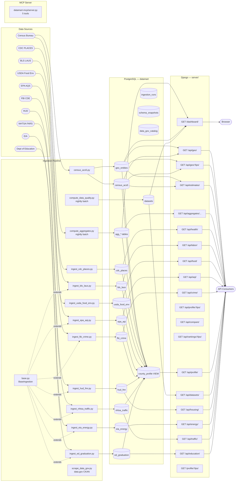

# Datamart — Design Document

## Overview

Datamart is a Data-as-a-Service platform that consolidates publicly available datasets into normalized, queryable PostgreSQL tables and exposes them through a REST API and an interactive web dashboard. The platform covers U.S. Census Bureau data at state and county level, extended with county-level health, labor, food environment, air quality, crime, housing, energy, traffic, and education data from CDC PLACES, BLS LAUS, USDA Food Environment Atlas, EPA AQS, FBI Crime Data Explorer, HUD, EIA, NHTSA, and the Department of Education.

The platform has two layers:

- **Public component** — a queryable API delivering normalized, entity-level data with filtering and pagination, plus a browser dashboard for exploratory analysis
- **Enterprise extension** (future) — private data integration allowing organizations to layer proprietary datasets on top of the public foundation

### Architecture



---

## Repository Layout

```
datamart/
├── .github/
│   └── workflows/
│       ├── ci.yml                    # Run tests on push / PR
│       └── nightly_aggregates.yml    # Daily: compute_aggregates + compute_data_quality
├── config/
│   ├── .env                          # DB credentials and API keys (not committed)
│   └── .env.example
├── ingestion/
│   ├── base.py                       # BaseIngestion: shared fetch → parse → upsert → CLI
│   ├── census_acs5.py                # Census ACS5 fetch → normalize → load
│   ├── compute_aggregates.py         # Nightly batch: recompute all agg_* tables
│   ├── compute_data_quality.py       # Nightly batch: null rates + row counts → datasets
│   ├── ingest_cdc_places.py          # CDC PLACES health outcomes (Socrata API)
│   ├── ingest_bls_laus.py            # BLS LAUS unemployment (flat-file download)
│   ├── ingest_usda_food_env.py       # USDA Food Environment Atlas (Excel file)
│   ├── ingest_epa_aqi.py             # EPA Air Quality Index (ZIP+CSV per year)
│   ├── ingest_fbi_crime.py           # FBI Crime Data Explorer (ZIP+CSV per year)
│   ├── ingest_hud_fmr.py             # HUD Fair Market Rents (annual Excel per county)
│   ├── ingest_eia_energy.py          # EIA energy consumption (state-level, BBTU)
│   ├── ingest_nhtsa_traffic.py       # NHTSA FARS traffic fatalities (county-level)
│   ├── ingest_ed_graduation.py       # EDFacts graduation rates (LEAID→county crosswalk)
│   ├── scrape_data_gov.py            # data.gov CKAN catalog scraper (scored 0–100; requires DATA_GOV_API_KEY)
│   └── compute_data_quality.py       # null-rate + row-count refresh for all sources
├── datamart-mcp/
│   └── server.py                     # MCP server — 5 tools exposing the API to AI assistants
├── schema/
│   └── schema.sql                    # Canonical DDL — all tables + county_profile view
├── migrations/
│   ├── 000_schema_version.sql
│   ├── 001_initial_schema.sql
│   ├── 002_aggregate_tables.sql
│   ├── 003_cdc_places.sql
│   ├── 004_bls_laus.sql
│   ├── 005_usda_food_env.sql
│   ├── 006_county_profile_view.sql
│   ├── 007_epa_aqi.sql
│   ├── 008_fbi_crime.sql
│   ├── 009_datasets_catalog.sql
│   ├── 010_census_additional_vars.sql
│   ├── 011_hud_fmr.sql
│   ├── 012_eia_energy.sql
│   ├── 013_nhtsa_traffic.sql
│   ├── 014_ed_graduation.sql
│   ├── 015_governance_ingestion_runs.sql  # ingestion_runs audit log + ingestion_run_id FKs on all 10 source tables
│   ├── 016_schema_snapshots.sql           # schema_snapshots column-level drift detection
│   ├── 017_datasets_governance.sql        # 6 governance columns on datasets (license, sensitivity, etc.)
│   ├── 018_governance_seeds.sql           # CC0-1.0 seeds for all 10 sources
│   ├── 019_data_gov_catalog.sql           # data_gov_catalog table (402k data.gov datasets, scored 0–100)
│   ├── 020_data_gov_indexes.sql           # indexes on data_gov_catalog
│   └── migrate.sh
├── requirements.txt
├── server/
│   ├── manage.py
│   ├── datamart_api/                 # Django project settings, urls, wsgi
│   ├── census/                       # Django app: REST API (models, serializers, views, urls)
│   └── dashboard/                    # Django app: web dashboard
│       └── templates/dashboard/
│           ├── index.html            # main dashboard
│           ├── profile.html          # county profile page
│           └── _metric.html          # metric row partial
├── tests/
│   ├── test_ingestion.py             # Unit tests for Census ACS5 ingestion helpers
│   ├── test_api.py                   # Django integration tests for all API endpoints + dashboard
│   ├── test_aggregates.py            # Unit tests for compute_aggregates SQL builders
│   ├── test_external_ingestion.py    # Unit tests for CDC, BLS, USDA, EPA, FBI ingestion
│   ├── test_data_quality.py          # Unit tests for compute_data_quality
│   ├── test_base_ingestion.py        # Unit tests for BaseIngestion
│   ├── test_mcp_server.py            # Unit tests for MCP server tools
│   └── test_scrape_data_gov.py       # Unit tests for data.gov CKAN scraper
├── conftest.py
└── pytest.ini
```

---

## Data Model

The canonical DDL is in [`schema/schema.sql`](schema/schema.sql) (currently at migration 020). All tables are created there; the `county_profile` view is rebuilt by each migration that adds a new source.

### `geo_entities`

A reference table for every geographic unit the platform knows about. Currently populated with U.S. states and counties.

| Column      | Type          | Notes                                     |
|-------------|---------------|-------------------------------------------|
| `fips`      | VARCHAR(5) PK | 2 chars for states, 5 chars for counties  |
| `geo_type`  | VARCHAR(10)   | `'state'` or `'county'`                   |
| `name`      | VARCHAR(200)  | Human-readable name from Census API       |
| `state_fips`| CHAR(2)       | Parent state; same as `fips` for states   |

### `census_acs5`

One row per geography × year. All percentage fields are pre-computed ratios (not raw counts). Unique on `(fips, year)`.

| Column                | Type         | Source variables                                    |
|-----------------------|--------------|-----------------------------------------------------|
| `fips`                | VARCHAR(5) FK| Links to `geo_entities`                             |
| `year`                | SMALLINT     | ACS5 vintage year                                   |
| `population`          | INTEGER      | B01003_001E                                         |
| `median_income`       | INTEGER      | B19013_001E                                         |
| `pct_bachelors`       | NUMERIC(5,2) | B15003_022E / B15003_001E × 100                     |
| `median_home_value`   | INTEGER      | B25077_001E                                         |
| `pct_owner_occupied`  | NUMERIC(5,2) | B25003_002E / B25003_001E × 100                     |
| `pct_poverty`         | NUMERIC(5,2) | B17001_002E / B17001_001E × 100                     |
| `unemployment_rate`   | NUMERIC(5,2) | B23025_005E / B23025_002E × 100                     |
| `pct_health_insured`  | NUMERIC(5,2) | C27001_002E / C27001_001E × 100                     |
| `mean_commute_minutes`| NUMERIC(5,1) | B08136_001E / (B08301_001E − B08301_021E)           |
| `pct_white`           | NUMERIC(5,2) | B02001_002E / B02001_001E × 100                     |
| `pct_black`           | NUMERIC(5,2) | B02001_003E / B02001_001E × 100                     |
| `pct_hispanic`        | NUMERIC(5,2) | B03003_003E / B03003_001E × 100                     |
| `pct_asian`           | NUMERIC(5,2) | B02001_005E / B02001_001E × 100                     |
| `fetched_at`          | TIMESTAMPTZ  | Set to `NOW()` on insert/update                     |

**Current data volume:** 3,283 geographies (52 state-equivalents + 3,231 counties), 5 vintages (2018–2022), ~16,400 estimate rows.

### Aggregate Tables

Pre-computed and fully rewritten on each nightly batch run. All four tables have a `computed_at TIMESTAMPTZ` column.

#### `agg_national_summary`

Population-weighted national averages per year, derived from state-level data. Unique on `year`.

#### `agg_state_summary`

Population-weighted county rollups per state per year. Unique on `(state_fips, year)`.

Both tables share the same avg columns: `avg_median_income`, `avg_pct_bachelors`, `avg_median_home_value`, `avg_pct_owner_occupied`, `avg_pct_poverty`, `avg_unemployment_rate`.

#### `agg_rankings`

Rank and percentile for every geography × year × metric within its peer group (`geo_type`). Unique on `(fips, year, metric)`.

| Column      | Type          | Notes                                 |
|-------------|---------------|---------------------------------------|
| `fips`      | VARCHAR(5)    |                                       |
| `state_fips`| CHAR(2)       | Denormalized for state-level filtering|
| `geo_type`  | VARCHAR(10)   | Peer group                            |
| `year`      | SMALLINT      |                                       |
| `metric`    | VARCHAR(30)   | e.g. `median_income`                  |
| `value`     | NUMERIC(12,2) |                                       |
| `rank`      | INTEGER       | 1 = lowest value in peer group        |
| `percentile`| NUMERIC(5,2)  | 0–100                                 |
| `peer_count`| INTEGER       |                                       |

#### `agg_yoy`

Year-over-year absolute and percentage change per geography × metric. Unique on `(fips, year, metric)`.

| Column      | Type          | Notes                    |
|-------------|---------------|--------------------------|
| `year`      | SMALLINT      | The "current" year       |
| `value`     | NUMERIC(12,2) | Current year value       |
| `prev_value`| NUMERIC(12,2) | Prior year value         |
| `change_abs`| NUMERIC(12,2) | `value - prev_value`     |
| `change_pct`| NUMERIC(7,2)  | % change from prior year |

### External-Source Tables

#### `cdc_places`

County-level health outcome estimates from CDC PLACES (crude prevalence %). One row per county × year. Unique on `(fips, year)`.

| Column                   | Type         | CDC measure ID |
|--------------------------|--------------|----------------|
| `pct_obesity`            | NUMERIC(5,1) | OBESITY        |
| `pct_diabetes`           | NUMERIC(5,1) | DIABETES       |
| `pct_smoking`            | NUMERIC(5,1) | CSMOKING       |
| `pct_hypertension`       | NUMERIC(5,1) | BPHIGH         |
| `pct_depression`         | NUMERIC(5,1) | DEPRESSION     |
| `pct_no_lpa`             | NUMERIC(5,1) | LPA            |
| `pct_poor_mental_health` | NUMERIC(5,1) | MHLTH          |

Source: Socrata API at `https://data.cdc.gov/resource/swc5-untb.json`

#### `bls_laus`

Annual average unemployment and labor force estimates from BLS Local Area Unemployment Statistics. One row per county × year. Unique on `(fips, year)`.

| Column              | Type         | Notes               |
|---------------------|--------------|---------------------|
| `labor_force`       | INTEGER      |                     |
| `employed`          | INTEGER      |                     |
| `unemployed`        | INTEGER      |                     |
| `unemployment_rate` | NUMERIC(5,1) |                     |

Downloaded from the BLS flat-file URL: `https://www.bls.gov/lau/laucnty{yy}.txt`. One tab-delimited file per year covers all ~3,100 counties with no rate-limiting.

#### `usda_food_env`

County-level food environment metrics from the USDA Food Environment Atlas Excel file. One row per county × data vintage. Unique on `(fips, data_year)`.

| Column               | Type         | Atlas sheet   | Source column     |
|----------------------|--------------|---------------|-------------------|
| `pct_low_food_access`| NUMERIC(5,1) | ACCESS        | PCT_LACCESS_POP15 |
| `groceries_per_1000` | NUMERIC(6,2) | STORES        | GROCPTH16         |
| `fast_food_per_1000` | NUMERIC(6,2) | RESTAURANTS   | FFRPTH16          |
| `pct_snap`           | NUMERIC(5,1) | ASSISTANCE    | PCT_SNAP17        |
| `farmers_markets`    | INTEGER      | LOCAL         | FMRKT18           |

Sentinel value `-9999` is treated as NULL.

#### `epa_aqi`

Annual air quality summary from EPA AQS. One row per county × year. Unique on `(fips, year)`.

| Column                    | Type         | Notes                                |
|---------------------------|--------------|--------------------------------------|
| `days_with_aqi`           | SMALLINT     | Days with AQI data reported          |
| `good_days`               | SMALLINT     | AQI 0–50                             |
| `moderate_days`           | SMALLINT     | AQI 51–100                           |
| `unhealthy_sensitive_days`| SMALLINT     | AQI 101–150                          |
| `unhealthy_days`          | SMALLINT     | AQI 151–200                          |
| `very_unhealthy_days`     | SMALLINT     | AQI 201–300                          |
| `hazardous_days`          | SMALLINT     | AQI 301+                             |
| `max_aqi`                 | SMALLINT     | Annual maximum AQI                   |
| `median_aqi`              | NUMERIC(6,1) | Annual median AQI                    |
| `pm25_days`               | SMALLINT     | Days PM2.5 was the dominant pollutant|
| `ozone_days`              | SMALLINT     | Days ozone was the dominant pollutant|

Downloaded from EPA AQS: `https://aqs.epa.gov/aqsweb/airdata/annual_aqi_by_county_{year}.zip`. County names are matched to FIPS via a normalized name lookup against `geo_entities`.

#### `fbi_crime`

Annual violent and property crime rates from FBI Crime Data Explorer. One row per county × year (aggregated from agency-level rows). Unique on `(fips, year)`.

| Column               | Type         | Notes                                  |
|----------------------|--------------|----------------------------------------|
| `population_covered` | INTEGER      | Sum of agency populations in county    |
| `violent_crimes`     | INTEGER      | Sum of all violent crime incidents     |
| `violent_crime_rate` | NUMERIC(8,1) | Violent crimes per 100,000 population  |
| `property_crimes`    | INTEGER      | Sum of all property crime incidents    |
| `property_crime_rate`| NUMERIC(8,1) | Property crimes per 100,000 population |

Downloaded from: `https://cde.ucr.cjis.gov/LATEST/webapp/assets/data/county_{year}.zip`. Multiple agency rows per county are aggregated by summing, then rates are computed.

#### `hud_fmr`

Annual Fair Market Rents from HUD. One row per county × year. Unique on `(fips, year)`.

| Column    | Type    | Notes                         |
|-----------|---------|-------------------------------|
| `fips`    | VARCHAR(5) FK | Links to `geo_entities` |
| `year`    | SMALLINT | FMR year                     |
| `fmr_0br` | INTEGER | Studio FMR ($/month)         |
| `fmr_1br` | INTEGER | 1-bedroom FMR                |
| `fmr_2br` | INTEGER | 2-bedroom FMR                |
| `fmr_3br` | INTEGER | 3-bedroom FMR                |
| `fmr_4br` | INTEGER | 4-bedroom FMR                |

#### `eia_energy`

Annual energy consumption from EIA. One row per state × year (state-level only). Unique on `(state_fips, year)`.

| Column           | Type    | Notes                               |
|------------------|---------|-------------------------------------|
| `state_fips`     | CHAR(2) FK | Links to `geo_entities`          |
| `year`           | SMALLINT |                                    |
| `elec_res_bbtu`  | INTEGER | Residential electricity (BBTU)     |
| `elec_com_bbtu`  | INTEGER | Commercial electricity             |
| `elec_ind_bbtu`  | INTEGER | Industrial electricity             |
| `elec_total_bbtu`| INTEGER | Total electricity                  |
| `gas_res_bbtu`   | INTEGER | Residential natural gas (BBTU)     |
| `gas_com_bbtu`   | INTEGER | Commercial natural gas             |
| `gas_ind_bbtu`   | INTEGER | Industrial natural gas             |
| `gas_total_bbtu` | INTEGER | Total natural gas                  |

#### `nhtsa_traffic`

Annual traffic fatality counts from NHTSA FARS. One row per county × year. Unique on `(fips, year)`.

| Column          | Type         | Notes                            |
|-----------------|--------------|----------------------------------|
| `fips`          | VARCHAR(5) FK | Links to `geo_entities`         |
| `year`          | SMALLINT     |                                  |
| `fatalities`    | INTEGER      | Total traffic fatalities         |
| `fatality_rate` | NUMERIC(6,1) | Fatalities per 100,000 pop       |

#### `ed_graduation`

4-year adjusted cohort graduation rates from EDFacts. Aggregated from district (LEAID) to county via Urban Institute school directory crosswalk. One row per county × school year. Unique on `(fips, school_year)`.

| Column          | Type         | Notes                                    |
|-----------------|--------------|------------------------------------------|
| `fips`          | VARCHAR(5) FK | Links to `geo_entities`                 |
| `school_year`   | SMALLINT     | Ending year of the school year           |
| `grad_rate_all` | NUMERIC(5,1) | ACGR — all students (%)                 |
| `grad_rate_ecd` | NUMERIC(5,1) | ACGR — economically disadvantaged (%)   |
| `cohort_all`    | INTEGER      | Total cohort size                        |
| `num_districts` | SMALLINT     | Number of districts aggregated           |

#### `datasets`

Source catalog — one row per ingested data source. Updated by ingestion scripts (`mark_ingested`) and `compute_data_quality.py`.

| Column                    | Type         | Notes                                         |
|---------------------------|--------------|-----------------------------------------------|
| `source_key`              | VARCHAR(30)  | Unique key matching ingestion scripts         |
| `name`                    | VARCHAR(100) | Human-readable name                           |
| `description`             | TEXT         |                                               |
| `source_url`              | TEXT         | Canonical data source URL                     |
| `entity_type`             | VARCHAR(20)  | `'county'`, `'state'`, etc.                   |
| `update_cadence`          | VARCHAR(20)  | `'annual'`, `'monthly'`, etc.                 |
| `row_count`               | INTEGER      | Populated by `compute_data_quality.py`        |
| `null_rates`              | JSONB        | `{column: null_rate}` per metric column       |
| `last_ingested_at`        | TIMESTAMPTZ  | Set by `mark_ingested()` after each run       |
| `quality_computed_at`     | TIMESTAMPTZ  | Set by `compute_data_quality.py`              |
| `license_spdx`            | VARCHAR(50)  | SPDX license ID (e.g. `CC0-1.0`)             |
| `commercial_ok`           | BOOLEAN      | Whether commercial use is permitted           |
| `attribution_required`    | BOOLEAN      | Whether attribution is required               |
| `attribution_text`        | TEXT         | Attribution string if required                |
| `sensitivity_tier`        | SMALLINT     | 1 = public, 2 = restricted, 3 = private       |
| `min_population_suppress` | INTEGER      | Suppress rows below this population threshold |

All 10 active sources are seeded with `CC0-1.0`, `commercial_ok=true`, `sensitivity_tier=1`.

#### `ingestion_runs`

Immutable audit log of every ingestion attempt. Each source table has a nullable `ingestion_run_id` FK pointing here.

| Column         | Type         | Notes                                          |
|----------------|--------------|------------------------------------------------|
| `id`           | SERIAL PK    |                                                |
| `source_key`   | VARCHAR(30)  |                                                |
| `started_at`   | TIMESTAMPTZ  |                                                |
| `completed_at` | TIMESTAMPTZ  | NULL while in progress                         |
| `status`       | VARCHAR(20)  | `'running'`, `'success'`, `'error'`            |
| `rows_loaded`  | INTEGER      |                                                |
| `file_hash`    | VARCHAR(64)  | SHA-256 of source file for dedup               |
| `error_message`| TEXT         | NULL on success                                |

#### `schema_snapshots`

Column-level schema drift detection. One row per source × column × snapshot time.

| Column        | Type        | Notes                               |
|---------------|-------------|-------------------------------------|
| `source_key`  | VARCHAR(30) |                                     |
| `column_name` | VARCHAR(60) |                                     |
| `data_type`   | VARCHAR(30) |                                     |
| `is_nullable` | BOOLEAN     |                                     |
| `snapped_at`  | TIMESTAMPTZ |                                     |

#### `data_gov_catalog`

Scored metadata catalog from data.gov CKAN. Populated by `scrape_data_gov.py`. Currently ~5k rows scraped (402k total available).

| Column          | Type         | Notes                                            |
|-----------------|--------------|--------------------------------------------------|
| `package_id`    | UUID PK      | data.gov CKAN package identifier                 |
| `title`         | TEXT         |                                                  |
| `organization`  | VARCHAR(200) | Publishing agency                                |
| `tags`          | TEXT[]       |                                                  |
| `formats`       | TEXT[]       | Available download formats                       |
| `license_id`    | VARCHAR(100) |                                                  |
| `score`         | SMALLINT     | Relevance score 0–100 (county + open + recent)   |
| `metadata_modified` | DATE    |                                                  |
| `scraped_at`    | TIMESTAMPTZ  |                                                  |

### `county_profile` View

A cross-source read-only view joining all 10 data sources at county level. Each row is one county with the most recent available data from each source (via `LATERAL` subqueries ordered by year DESC). Exposed at `/api/profile/` and `/api/profile/<fips>/`.

Includes columns from `census_acs5`, `cdc_places`, `bls_laus`, `usda_food_env`, `epa_aqi`, `fbi_crime`, `nhtsa_traffic`, `hud_fmr`, and `ed_graduation`.

---

## Ingestion Pipeline

### Common Base Class

Source: [ingestion/base.py](ingestion/base.py)

`BaseIngestion` provides the standard lifecycle for flat-file sources. Subclass it and implement three methods:

```python
class MySource(BaseIngestion):
    source_key = "my_source"
    download_is_zip = True          # set True if the URL returns a ZIP

    def flat_file_url(self, year):  # return download URL for a given year
    def parse(self, content):       # bytes → {(fips, year): metrics_dict}
    def upsert(self, conn, records) # execute INSERT ... ON CONFLICT; return row count
```

`run(conn, start, end)` calls `fetch → parse → upsert` for each year in range, then calls `mark_ingested(conn)` to stamp `datasets.last_ingested_at`. `main()` provides a full CLI entry point with `--start`, `--end`, `--file`, and `--year` flags.

### Census ACS5

Source: [ingestion/census_acs5.py](ingestion/census_acs5.py)

Fetches 23 ACS5 variables per geography per year from `https://api.census.gov/data/{year}/acs/acs5`. Normalizes fields, handles Census sentinel values (`-666666666` → NULL), upserts into `geo_entities` and `census_acs5`. Single transaction per run.

New variables added in migration 010: health insurance (`C27001`), mean commute time (`B08136/B08301`), race/ethnicity (`B02001/B03003`).

### Aggregate Batch

Source: [ingestion/compute_aggregates.py](ingestion/compute_aggregates.py)

Truncates and fully recomputes all four `agg_*` tables in a single transaction. Population-weighted averages use `SUM(metric::numeric * population) / SUM(population) FILTER (WHERE metric IS NOT NULL)` to handle nulls without skewing denominators.

### Data Quality

Source: [ingestion/compute_data_quality.py](ingestion/compute_data_quality.py)

For each registered source, counts total rows and computes null rate per metric column using a single SQL query. Updates `datasets.row_count`, `datasets.null_rates`, and `datasets.quality_computed_at`. Continues after per-source errors.

```bash
python ingestion/compute_data_quality.py
```

### CDC PLACES

Source: [ingestion/ingest_cdc_places.py](ingestion/ingest_cdc_places.py)

Fetches county-level health prevalence estimates from the CDC Socrata API (paginated, `$limit=50000` per page). Pivots raw measure rows into one row per county × year. Upserts into `cdc_places`.

```bash
python ingestion/ingest_cdc_places.py [--year 2022] [--app-token TOKEN]
```

### BLS LAUS

Source: [ingestion/ingest_bls_laus.py](ingestion/ingest_bls_laus.py)

Downloads the annual BLS flat file (`laucnty{yy}.txt`) — one tab-delimited file per year covering all ~3,100 counties. Rows beginning with `"CN"` are county records; FIPS is constructed from state + county code columns. No API key or rate-limiting required.

```bash
python ingestion/ingest_bls_laus.py [--start 2018] [--end 2022]
python ingestion/ingest_bls_laus.py --file laucnty22.txt --year 2022
```

### USDA Food Environment Atlas

Source: [ingestion/ingest_usda_food_env.py](ingestion/ingest_usda_food_env.py)

Reads the USDA ERS Excel workbook (multiple sheets) using `openpyxl`. Merges columns from ACCESS, STORES, RESTAURANTS, ASSISTANCE, and LOCAL sheets by county FIPS. Upserts into `usda_food_env`.

```bash
python ingestion/ingest_usda_food_env.py --file /path/to/atlas.xlsx [--data-year 2018]
python ingestion/ingest_usda_food_env.py --download [--data-year 2018]
```

### EPA Air Quality Index

Source: [ingestion/ingest_epa_aqi.py](ingestion/ingest_epa_aqi.py)

Downloads the annual AQI CSV (inside a ZIP) from EPA AQS for each year. Matches county names to FIPS via normalized name matching against `geo_entities` (strips county/parish/borough suffixes). Upserts into `epa_aqi`.

```bash
python ingestion/ingest_epa_aqi.py [--start 2018] [--end 2022]
```

### FBI Crime Data

Source: [ingestion/ingest_fbi_crime.py](ingestion/ingest_fbi_crime.py)

Downloads the annual county-level CSV (inside a ZIP) from FBI Crime Data Explorer. Aggregates agency-level rows to county level by summing population and crime counts, then computes rates per 100,000. Upserts into `fbi_crime`.

```bash
python ingestion/ingest_fbi_crime.py [--start 2018] [--end 2022]
```

**Note:** Current approach produces 0 rows — needs redesign around per-ORI API calls or NIBRS bulk extract (see issue #26).

### HUD Fair Market Rents

Source: [ingestion/ingest_hud_fmr.py](ingestion/ingest_hud_fmr.py)

Downloads the annual HUD FMR Excel file for each year. Parses bedroom-count FMR columns and maps county-level FIPS from the HUD dataset. Upserts into `hud_fmr`. Extends `BaseIngestion`.

```bash
python ingestion/ingest_hud_fmr.py [--start 2018] [--end 2022]
```

### EIA Energy Consumption

Source: [ingestion/ingest_eia_energy.py](ingestion/ingest_eia_energy.py)

Downloads state-level energy consumption data from the EIA. Extracts electricity and natural gas BBTU by sector (residential, commercial, industrial). State-level only (no county breakdown available). Upserts into `eia_energy`. Extends `BaseIngestion`.

```bash
python ingestion/ingest_eia_energy.py [--start 2018] [--end 2022]
```

### NHTSA Traffic Fatalities

Source: [ingestion/ingest_nhtsa_traffic.py](ingestion/ingest_nhtsa_traffic.py)

Downloads the NHTSA FARS (Fatality Analysis Reporting System) county-level file. Computes fatality rate per 100,000 population using Census population data. Upserts into `nhtsa_traffic`. Extends `BaseIngestion`.

```bash
python ingestion/ingest_nhtsa_traffic.py [--start 2018] [--end 2022]
```

### Education Graduation Rates

Source: [ingestion/ingest_ed_graduation.py](ingestion/ingest_ed_graduation.py)

Downloads EDFacts 4-year Adjusted Cohort Graduation Rate (ACGR) data from the Department of Education. Aggregates district-level (LEAID) data to county level via the Urban Institute school directory crosswalk. Reports rates for all students and economically disadvantaged students separately. Upserts into `ed_graduation`. Extends `BaseIngestion`.

```bash
python ingestion/ingest_ed_graduation.py [--start 2018] [--end 2022]
```

---

## API Layer

Source: [`server/census/`](server/census/)

Built with Django 6 and Django REST Framework. Models use `managed = False`. All list endpoints support `?page_size=N` (max 400) via `FlexiblePageNumberPagination` (default 50).

### Core endpoints

#### `GET /api/geo/`
Paginated list of geographic entities. Params: `geo_type` (`state`|`county`), `state_fips`.

#### `GET /api/geo/<fips>/`
Single geography with all ACS5 estimates embedded, ordered by year.

#### `GET /api/estimates/`
Flat, paginated estimates with geo metadata inlined. Params: `geo_type`, `state_fips`, `year`.

**Range filters:** any numeric Census metric supports `{metric}__{gte|lte|gt|lt}` params, e.g. `pct_poverty__gte=20&median_income__lte=50000`. Supported metrics: `median_income`, `pct_bachelors`, `median_home_value`, `pct_owner_occupied`, `pct_poverty`, `unemployment_rate`, `pct_health_insured`, `mean_commute_minutes`, `pct_white`, `pct_black`, `pct_hispanic`, `pct_asian`.

### Aggregate endpoints

#### `GET /api/aggregates/national/`
Params: `year`.

#### `GET /api/aggregates/state-summary/`
Params: `state_fips`, `year`.

#### `GET /api/aggregates/rankings/`
Params: `geo_type`, `state_fips`, `year`, `metric`.

#### `GET /api/aggregates/yoy/`
Params: `geo_type`, `state_fips`, `year`, `metric`. Returns `value`, `prev_value`, `change_abs`, `change_pct`.

### External-source endpoints

#### `GET /api/health/`
CDC PLACES health outcomes. Params: `fips`, `state_fips`, `year`.

#### `GET /api/labor/`
BLS LAUS annual unemployment. Params: `fips`, `state_fips`, `year`.

#### `GET /api/food/`
USDA Food Environment metrics. Params: `fips`, `state_fips`, `data_year`.

#### `GET /api/aqi/`
EPA Air Quality Index annual summary. Params: `fips`, `state_fips`, `year`.

#### `GET /api/crime/`
FBI violent and property crime rates. Params: `fips`, `state_fips`, `year`.

#### `GET /api/profile/`
Unified county profile joining all sources (most recent year per source). Params: `fips`, `state_fips`. Backed by the `county_profile` view.

#### `GET /api/profile/<fips>/`
Single-county profile detail. Returns one object (not paginated). 404 if the FIPS is not found.

#### `GET /api/compare/`
Side-by-side profiles for up to 6 counties. Param: `fips` (comma-separated, e.g. `?fips=06037,48201`). Returns a paginated list of `county_profile` rows.

#### `GET /api/rankings/<fips>/`
All ranking metrics for one county from `agg_rankings`. Param: `year` (optional, filters to a single vintage). Returns `metric`, `year`, `value`, `rank`, `percentile`, `peer_count`.

#### `GET /api/housing/`
HUD Fair Market Rents by bedroom count per county. Params: `fips`, `state_fips`, `year`.

#### `GET /api/energy/`
EIA state-level energy consumption (electricity and natural gas BBTU by sector). Params: `state_fips`, `year`.

#### `GET /api/traffic/`
NHTSA FARS annual traffic fatalities and rate per 100k population per county. Params: `fips`, `state_fips`, `year`.

#### `GET /api/education/`
EDFacts 4-year ACGR graduation rates per county (all students and economically disadvantaged). Params: `fips`, `state_fips`, `school_year`.

#### `GET /api/datasets/`
Source catalog with quality stats for all ingested datasets. Returns `source_key`, `name`, `row_count`, `null_rates`, `last_ingested_at`, `quality_computed_at`.

### Validation

`geo_type`, `year`, and `metric` params are validated on all applicable endpoints; invalid values return HTTP 400 with a descriptive error body.

---

## Dashboard

Source: [`server/dashboard/`](server/dashboard/)

A browser-based dashboard served at `/dashboard/`. Built with Django templates, Bootstrap 5, and Chart.js.

All state-level aggregate data (Census, health, food) is embedded as JSON at render time. County-level data is fetched via AJAX when a state is selected. All results are cached client-side per state×year key so metric and chart switching after the first load is instant.

### Data embedded at render time

| Variable | Source |
|---|---|
| `national` | `agg_national_summary` — national Census averages per year |
| `stateSummary` | `agg_state_summary` — state-level Census rollups per year |
| `stateYoY` | `agg_yoy` (state rows only) — Census year-over-year changes |
| `stateHealth` | `cdc_places` GROUP BY LEFT(fips,2) — state avg of all 7 health metrics |
| `stateFood` | `usda_food_env` GROUP BY LEFT(fips,2) — state avg of all 5 food metrics; sentinel-filtered with `__gte=0` per column |
| `catalogDatasets` | `datasets` — all sources with row_count, null_rates, last_ingested_at |

### All-states mode (no state selected)

| Chart | Type | Data source |
|---|---|---|
| National Trend | Line | `national` (embedded) — Census metrics only; hidden for health/food metrics |
| State Ranking | Horizontal bar | `stateSummary` (Census), `stateHealth`, or `stateFood` depending on active metric |
| YoY Movers | Horizontal bar (top 5 + bottom 5) | `stateYoY` (Census metrics only); shows "not available" note for health/food |

### County drill-down mode (state selected)

Seven panels are shown. County-level data is fetched in a single `Promise.all()`.

| Panel | Type | Data source | Cache key |
|---|---|---|---|
| National Trend | Line | Embedded (unchanged) | — |
| County Ranking | Horizontal bar | `/api/aggregates/rankings/` (Census) or `profileData` (health/food) | — |
| YoY Movers | Horizontal bar | `/api/aggregates/yoy/` (Census); note for health/food | — |
| Health Outcomes | Horizontal bar | `/api/health/?state_fips&year` | `healthCache[stateFips:year]` |
| Food Environment | Horizontal bar | `/api/food/?state_fips` | `foodCache[stateFips]` |
| Cross-source Scatter | Scatter | `/api/profile/?state_fips` | `profileCache[stateFips]` |
| County Data Table | Sortable table | `/api/profile/?state_fips` | `profileCache[stateFips]` (shared) |

### Data Sources panel (always visible)

A catalog panel at the bottom of the dashboard always visible regardless of state selection. For each of the six data sources, shows:

- **Source name** and `source_key`
- **Row count** (formatted, from `datasets.row_count`)
- **Last ingested** — relative date badge, color-coded: green (≤30 days), yellow (>30 days), grey (never ingested)
- **Completeness bar** — progress bar derived from average non-null rate across all metric columns. Green ≥95%, amber ≥80%, red <80%.

### Controls

- **Metric** dropdown — grouped optgroups covering all three sources: Census ACS5 (6 metrics), Health — CDC PLACES (7 metrics), Food — USDA Atlas (5 metrics). Drives the ranking chart and national trend.
- **Year** dropdown — vintage year (2018–2022); drives Census ranking/YoY and health endpoint calls.
- **Drill into State** dropdown — activates county mode; triggers a `Promise.all()` for all county data.
- **Health metric** dropdown (county mode) — which CDC PLACES measure to show in the health bar chart.
- **Food metric** dropdown (county mode) — which USDA metric to show in the food bar chart.
- **Scatter X / Y** dropdowns (county mode) — any metric from any source on each axis.

### Cross-source scatter

Plots each county in a selected state as a point with one metric on each axis. Defaults to Poverty Rate (X) vs Obesity % (Y). Any metric from any source can be chosen for either axis via the two selects in the card header. Negative and sentinel values are excluded (`x < 0 || y < 0`). County name appears in the tooltip.

### County data table

Sortable by any column. Shows 11 columns from all four sources per county: County Name, Population, Median Income, Poverty %, Bachelors %, Obesity %, Diabetes %, Depression %, Low Food Access %, SNAP %, Grocery Stores /1k. Column headers are color-coded by source (blue = Census, pink = Health, green = Food). Click a header to sort ascending; click again to sort descending.

---

## County Profile Page

Source: [`server/dashboard/templates/dashboard/profile.html`](server/dashboard/templates/dashboard/profile.html)

Served at `/profile/<fips>/`. A full single-county view with all 10 data sources organized in cards, a national rankings table, and a compare widget.

### Data loading

`ProfileView` (Django `TemplateView`) loads two queries at render time:

- `CountyProfile.objects.get(fips=fips)` — all cross-source fields via the `county_profile` view; raises 404 if not found
- `AggRanking.objects.filter(fips=fips).order_by("metric", "-year")` — deduped to the most recent year per metric and passed as `rankings_json`

### Rankings table

Renders one row per metric showing `value`, national `rank`, `percentile` (with a colored progress bar), and `peer_count`. Color coding: ≥75th percentile green, ≥50th yellow, <50th red.

### Compare widget

Enter up to 5 additional FIPS codes. Builds a link to `/api/compare/?fips=<current>,<added...>` once at least one county is added.

---

## MCP Server

Source: [`datamart-mcp/server.py`](datamart-mcp/server.py)

An MCP (Model Context Protocol) server exposing the Datamart API to AI assistants (Claude Desktop, Claude Code, etc.).

### Tools

| Tool | Description |
|---|---|
| `get_county_profile` | Full profile for one county by FIPS — calls `/api/profile/<fips>/` |
| `search_counties` | Search by name and/or state — calls `/api/geo/` |
| `get_state_summary` | Census aggregates for a state — calls `/api/aggregates/state-summary/` |
| `compare_counties` | Side-by-side profiles for up to 6 FIPS codes — calls `/api/compare/` |
| `list_datasets` | Source catalog with quality stats — calls `/api/datasets/` |

### Configuration

```json
{
  "mcpServers": {
    "datamart": {
      "command": "python",
      "args": ["/path/to/datamart-mcp/server.py"]
    }
  }
}
```

Set `DATAMART_API_URL` env var if the API is not on `http://localhost:8000/api` (default).

---

## Automation

Source: [`.github/workflows/`](.github/workflows/)

### CI (`ci.yml`)

Runs on every push to `main` and every pull request. Spins up a PostgreSQL 15 service container, applies `schema/schema.sql`, and runs the full test suite.

### Nightly Aggregates (`nightly_aggregates.yml`)

Runs daily at 06:00 UTC (midnight PT). Applies the schema (idempotent), then runs `compute_aggregates.py` and `compute_data_quality.py`. Both scripts use DB credentials from GitHub Actions secrets (`DB_PASSWORD`, `CENSUS_API_KEY`). Can also be triggered manually via `workflow_dispatch`.

---

## Testing

Source: [`tests/`](tests/)

Run with:
```bash
python -m pytest tests/ -v
```

**407 tests total.**

### test_ingestion.py — 47 unit tests

Pure Python, no database. Covers Census ACS5 ingestion helpers: `_int()`, `_pct()`, `_mean_commute()`, `normalize_state()` (including all new health/commute/race fields), `normalize_county()`, `_fetch()` (mocked HTTP), and `load()` (mocked psycopg2).

### test_api.py — 160 Django integration tests

Uses Django's `TestCase` with a real PostgreSQL test database. All `managed = False` tables are created via `connection.schema_editor()`. Test classes:

- **`GeoAPITest`** — core endpoints, all filter params, 404, estimate ordering, validation
- **`AggregateAPITest`** — all four aggregate endpoints, filter params, validation
- **`DashboardTest`** — 200 response, embedded JSON, chart canvas IDs, health/food metric labels, catalog panel JSON and HTML presence
- **`ExternalSourceAPITest`** — `/api/health/`, `/api/labor/`, `/api/food/`: all filter params and field presence
- **`CountyProfileAPITest`** — `/api/profile/` (list + filters), `/api/profile/<fips>/` (detail, 404), `/api/compare/` (multi-county, cap, empty); all 10 source fields
- **`CountyRankingsAPITest`** — `/api/rankings/<fips>/`: all metrics for a county, `?year` filter, empty on unknown FIPS, field presence
- **`EpaAqiAPITest`** — `/api/aqi/`: filter params, all 11 AQI metric fields
- **`FbiCrimeAPITest`** — `/api/crime/`: filter params, all crime rate fields
- **`HudFmrAPITest`** — `/api/housing/`: filter params, all bedroom-count FMR fields
- **`EiaEnergyAPITest`** — `/api/energy/`: filter params, all electricity/gas sector fields
- **`NhtsaTrafficAPITest`** — `/api/traffic/`: filter params, fatality count and rate fields
- **`EdGraduationAPITest`** — `/api/education/`: filter params, ACGR fields for all students and economically disadvantaged
- **`DatasetCatalogAPITest`** — `/api/datasets/`: all sources, row_count, null_rates fields
- **Range filter tests** in `GeoAPITest` — `__gte`, `__lte`, invalid metric rejection, multi-param combination

### test_aggregates.py — 30 unit tests

Pure Python. Covers `compute_aggregates.py` SQL builder functions: UNION ALL count, metric literals, window functions, transaction order.

### test_external_ingestion.py — 112 unit tests

Pure Python, no database or HTTP. Covers:

- **CDC PLACES** — `pivot()`, `fetch_places()`, `upsert()`, `ingest()`
- **BLS LAUS** — `parse_flat_file()` (county row detection, FIPS construction, comma stripping, year parsing), `upsert()`, `ingest()`
- **USDA Food Env** — `_safe()`, `load_workbook_data()`, `upsert()`
- **EPA AQI** — `normalize_county()`, `parse_aqi_csv()`, `match_to_fips()`, `upsert()`
- **FBI Crime** — `parse_crime_csv()` (agency aggregation, rate computation, zero-population handling), `upsert()`
- **HUD FMR** — `parse()`, `upsert()`, bedroom-count columns, FIPS mapping
- **EIA Energy** — `parse()`, `upsert()`, sector BBTU columns, state-level entity mapping
- **NHTSA Traffic** — `parse()`, `upsert()`, fatality rate computation, zero-population guard
- **Education Graduation** — `parse()`, `upsert()`, district aggregation, range value handling, crosswalk matching

### test_data_quality.py — 9 unit tests

Pure Python. Covers `compute_quality()` (row count, null rates dict, empty table, Decimal cast), `update_catalog()` (execute + commit), `run()` (all sources processed, continues after error, SOURCE_CONFIG coverage).

### test_base_ingestion.py — 19 unit tests

Pure Python. Covers `BaseIngestion`: `fetch()` (HTTP, zip extraction, year substitution, HTTP error), `mark_ingested()` (SQL, source_key, commit), `run()` (year iteration, total count, mark_ingested called once, records passed to upsert), `build_parser()` (defaults, overrides), abstract method enforcement.

### test_mcp_server.py — 17 unit tests

Pure Python, mocked HTTP. Covers all 5 MCP tools: `get_county_profile`, `search_counties`, `get_state_summary`, `compare_counties`, `list_datasets`. Validates request construction, response parsing, and error handling.

### test_scrape_data_gov.py — 13 unit tests

Pure Python, mocked HTTP. Covers `scrape_data_gov.py`: pagination, scoring (county + open license + recent vintage), `--start-offset` resume, upsert logic, CSV/MD export.

---

## Configuration

All secrets and connection details live in [`config/.env`](config/.env) (excluded from version control):

```
CENSUS_API_KEY=...
DB_HOST=localhost
DB_PORT=5432
DB_NAME=datamart
DB_USER=...
DB_PASSWORD=
DJANGO_SECRET_KEY=...      # required in production
DJANGO_DEBUG=true
DJANGO_ALLOWED_HOSTS=localhost,127.0.0.1
# Optional
CDC_APP_TOKEN=...          # Socrata app token (increases rate limits)
DATA_GOV_API_KEY=...       # api.data.gov key; DEMO_KEY works but caps at 5k/day
```

---

## Schema

### Fresh install

Use `schema/schema.sql` to set up a brand-new database in one shot:

```bash
psql "$DB_URL" -f schema/schema.sql
```

This creates all tables and the `county_profile` view, and pre-populates `schema_migrations` so the migration runner knows they've been applied (currently through migration 020).

### Incremental migrations

For an existing database, `migrations/migrate.sh` applies only the pending numbered SQL files:

```
migrations/
  000_schema_version.sql         # bootstraps schema_migrations tracking table
  001_initial_schema.sql         # geo_entities + census_acs5
  002_aggregate_tables.sql       # agg_national_summary, agg_state_summary, agg_rankings, agg_yoy
  003_cdc_places.sql             # cdc_places table
  004_bls_laus.sql               # bls_laus table
  005_usda_food_env.sql          # usda_food_env table
  006_county_profile_view.sql    # county_profile cross-source view
  007_epa_aqi.sql                # epa_aqi table + updated county_profile view
  008_fbi_crime.sql              # fbi_crime table + updated county_profile view
  009_datasets_catalog.sql       # datasets catalog table (seeded with 6 sources)
  010_census_additional_vars.sql # census_acs5 health/commute/race columns + updated view
  011_hud_fmr.sql                # hud_fmr table + updated county_profile view
  012_eia_energy.sql             # eia_energy table (state-level)
  013_nhtsa_traffic.sql              # nhtsa_traffic table + updated county_profile view
  014_ed_graduation.sql              # ed_graduation table + updated county_profile view
  015_governance_ingestion_runs.sql  # ingestion_runs table + ingestion_run_id FKs on all 10 source tables
  016_schema_snapshots.sql           # schema_snapshots table
  017_datasets_governance.sql        # 6 governance columns on datasets
  018_governance_seeds.sql           # CC0-1.0 seeds for all 10 sources
  019_data_gov_catalog.sql           # data_gov_catalog table
  020_data_gov_indexes.sql           # indexes on data_gov_catalog
  migrate.sh                         # runner: applies pending migrations in order
```

```bash
export $(grep -v '^#' config/.env | xargs)
./migrations/migrate.sh
```

### Adding a new migration

1. Add the DDL to `migrations/NNN_description.sql`, wrapped in `BEGIN; ... COMMIT;`, ending with an `INSERT INTO schema_migrations` statement
2. Apply the same change to `schema/schema.sql` so it stays current
3. Run `./migrations/migrate.sh` against the target database
