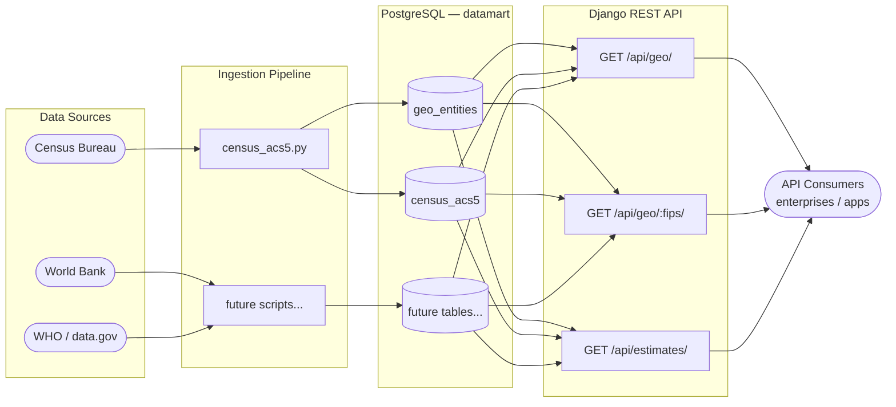

# Datamart — Design Document

## Overview

Datamart is a Data-as-a-Service platform that consolidates publicly available datasets into normalized, queryable PostgreSQL tables and exposes them through a REST API. The initial focus is U.S. Census Bureau data, with a roadmap to add World Bank, WHO, and other government sources.

The platform has two layers:

- **Public component** — a queryable API delivering normalized, entity-level data with filtering and pagination
- **Enterprise extension** (future) — private data integration allowing organizations to layer proprietary datasets on top of the public foundation

### Architecture



---

## Repository Layout

```
datamart/
├── config/
│   ├── .env                  # DB credentials and API keys (not committed)
│   └── .env.example
├── ingestion/
│   └── census_acs5.py        # Census ACS5 fetch → normalize → load
├── schema/
│   └── census.sql            # DDL for geo_entities and census_acs5 tables
├── api/
│   ├── manage.py
│   ├── requirements.txt
│   ├── datamart_api/         # Django project settings, urls, wsgi
│   └── census/               # Django app: models, serializers, views, urls
├── tests/
│   ├── test_ingestion.py     # Unit tests for ingestion helpers
│   └── test_api.py           # Django integration tests for API endpoints
├── conftest.py               # pytest path setup
└── pytest.ini
```

---

## Data Model

The schema lives in [`schema/census.sql`](schema/census.sql) and uses two tables.

### `geo_entities`

A reference table for every geographic unit the platform knows about. Currently populated with U.S. states and counties.

| Column      | Type         | Notes                                      |
|-------------|--------------|--------------------------------------------|
| `fips`      | VARCHAR(5) PK | 2 chars for states, 5 chars for counties  |
| `geo_type`  | VARCHAR(10)  | `'state'` or `'county'`                    |
| `name`      | VARCHAR(200) | Human-readable name from Census API        |
| `state_fips`| CHAR(2)      | Parent state; same as `fips` for states    |

Indexes on `geo_type` and `state_fips` support the most common filter patterns.

### `census_acs5`

One row per geography × year. All percentage fields are pre-computed ratios (not raw counts) to keep the API consumer-facing.

| Column              | Type           | Source variables                        |
|---------------------|----------------|-----------------------------------------|
| `fips`              | VARCHAR(5) FK  | Links to `geo_entities`                 |
| `year`              | SMALLINT       | ACS5 vintage year                       |
| `population`        | INTEGER        | B01003_001E                             |
| `median_income`     | INTEGER        | B19013_001E                             |
| `pct_bachelors`     | NUMERIC(5,2)   | B15003_022E / B15003_001E × 100         |
| `median_home_value` | INTEGER        | B25077_001E                             |
| `pct_owner_occupied`| NUMERIC(5,2)   | B25003_002E / B25003_001E × 100         |
| `pct_poverty`       | NUMERIC(5,2)   | B17001_002E / B17001_001E × 100         |
| `unemployment_rate` | NUMERIC(5,2)   | B23025_005E / B23025_002E × 100         |
| `fetched_at`        | TIMESTAMPTZ    | Set to `NOW()` on insert/update         |

The unique constraint on `(fips, year)` enables idempotent upserts — re-running the ingestion is always safe.

**Current data volume:** 3,283 geographies (52 state-equivalents + 3,231 counties), 5 vintages (2018–2022), ~16,400 estimate rows.

---

## Ingestion Pipeline

Source: [ingestion/census_acs5.py](ingestion/census_acs5.py)

The Census Bureau exposes ACS5 data via a JSON REST API at `https://api.census.gov/data/{year}/acs/acs5`. Each request fetches up to 50 variables for a given geography level.

### Flow


### Key design decisions

- **Sentinel handling** — The Census API returns `"-666666666"` for suppressed or unavailable values. `_int()` converts these (and any other negative) to `NULL` rather than storing a misleading integer.
- **Pre-computed percentages** — Raw counts (e.g., bachelor's degree holders and the population denominator) are fetched from the API but only the derived percentage is stored. This avoids exposing implementation detail to API consumers and keeps the schema stable if denominators change across vintages.
- **Single transaction per run** — All geo upserts and estimate upserts for the entire run commit together or not at all.
- **Idempotent upserts** — `ON CONFLICT ... DO UPDATE` means the script can be re-run without duplicating data.

---

## API Layer

Source: [`api/`](api/)

Built with Django 6 and Django REST Framework. The models mirror the existing PostgreSQL schema using `managed = False` — Django reads and writes to the tables but does not manage their lifecycle.

### Endpoints

#### `GET /api/geo/`

Returns a paginated list of geographic entities.

**Query parameters:**

| Param       | Description                          | Example          |
|-------------|--------------------------------------|------------------|
| `geo_type`  | Filter by `state` or `county`        | `?geo_type=state`|
| `state_fips`| Filter by 2-char state FIPS code     | `?state_fips=06` |

**Response shape:**
```json
{
  "count": 52,
  "next": "http://localhost:8001/api/geo/?geo_type=state&page=2",
  "previous": null,
  "results": [
    { "fips": "06", "geo_type": "state", "name": "California", "state_fips": "06" }
  ]
}
```

#### `GET /api/geo/<fips>/`

Returns a single geography with all ACS5 estimates embedded, ordered by year.

**Response shape:**
```json
{
  "fips": "06",
  "geo_type": "state",
  "name": "California",
  "state_fips": "06",
  "estimates": [
    {
      "year": 2018,
      "population": 39148760,
      "median_income": 71228,
      "pct_bachelors": "20.77",
      "median_home_value": 475900,
      "pct_owner_occupied": "54.65",
      "pct_poverty": "14.29",
      "unemployment_rate": "6.69",
      "fetched_at": "2026-04-23T23:25:44Z"
    }
  ]
}
```

#### `GET /api/estimates/`

Returns a flat, paginated list of estimates with geo metadata inlined. Useful for cross-geography queries.

**Query parameters:**

| Param       | Description                          |
|-------------|--------------------------------------|
| `geo_type`  | Filter by `state` or `county`        |
| `state_fips`| Filter to a specific state's records |
| `year`      | Filter to a single vintage year      |

**Response shape:**
```json
{
  "count": 58,
  "results": [
    {
      "fips": "06001",
      "geo_name": "Alameda County, California",
      "geo_type": "county",
      "state_fips": "06",
      "year": 2022,
      "population": 1663823,
      "median_income": 122488,
      ...
    }
  ]
}
```

### Pagination

All list endpoints use `PageNumberPagination` with `PAGE_SIZE = 50`. Navigate with the `?page=N` query parameter.

### Query optimization

- `GeoDetailView` uses `prefetch_related` with an explicit `Prefetch` object to avoid N+1 queries when embedding estimates.
- `EstimatesListView` uses `select_related("geo")` so geo fields are fetched in a single JOIN rather than per-row lookups.

---

## Testing

Source: [`tests/`](tests/)

Run with:
```bash
python -m pytest tests/ -v
```

### test_ingestion.py — 30 unit tests

Pure Python, no database. Covers:

- `_int()` — sentinel value, `None`, negatives, invalid strings, zero
- `_pct()` — valid ratios, rounding, zero/null denominator, sentinel denominator
- `normalize_state()` — FIPS zero-padding, geo_type, all computed fields, sentinel income
- `normalize_county()` — 5-char FIPS construction, state_fips extraction
- `_fetch()` — mocked HTTP: 301 redirect raises `RuntimeError`, `X-DataWebAPI-KeyError` header raises `RuntimeError`, valid response parsed correctly, header row stripped

### test_api.py — 14 Django integration tests

Uses Django's `TestCase` with a real PostgreSQL test database. Because the models are `managed = False`, tables are created manually via `connection.schema_editor()` before Django's `setUpClass` enters its atomic block, then dropped in `tearDownClass`. Covers all three endpoints, every filter parameter, 404 behavior, estimate ordering, and pagination structure.

---

## Configuration

All secrets and connection details live in [`config/.env`](config/.env) (excluded from version control):

```
CENSUS_API_KEY=...
DB_HOST=localhost
DB_PORT=5432
DB_NAME=datamart
DB_USER=...
DB_PASSWORD=
DJANGO_SECRET_KEY=...      # required in production
DJANGO_DEBUG=true
DJANGO_ALLOWED_HOSTS=localhost,127.0.0.1
```

---

## Roadmap

### Near-term
- **Range filters** on `/api/estimates/` — e.g., `pct_poverty__gte=20`, `median_income__lte=50000`
- **Additional Census variables** — health insurance (B27), commute time (B08), race/ethnicity (B02/B03)

### Additional data sources
- **World Bank** — country-level development indicators (GDP, life expectancy, education)
- **WHO** — global health metrics
- **data.gov** — supplementary federal datasets

### Platform
- **Common entity database** — normalized reference tables for countries, organizations, and people to link across datasets
- **Auth layer** — token-based authentication for rate limiting and enterprise private views
- **Django UI** — browsable interface for exploring and filtering datasets
- **Versioning and archival** — track schema changes and preserve historical snapshots
